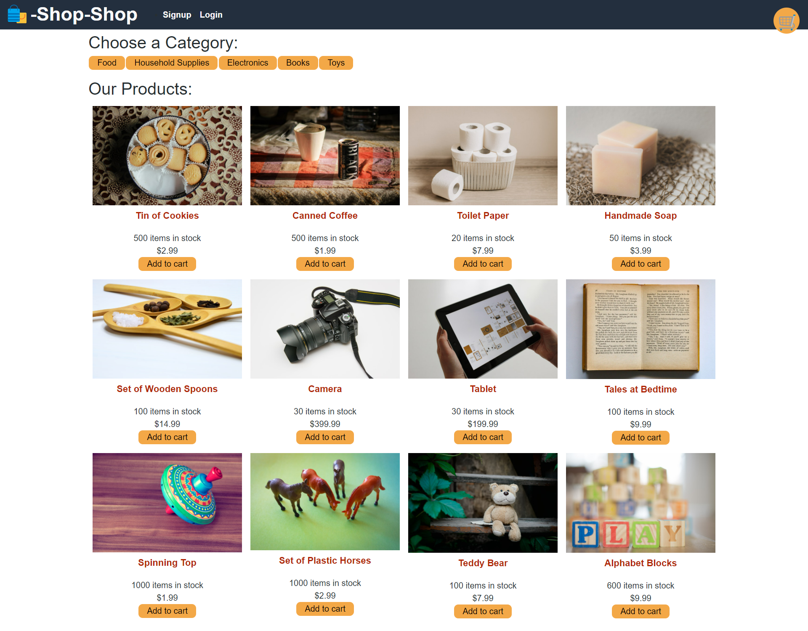
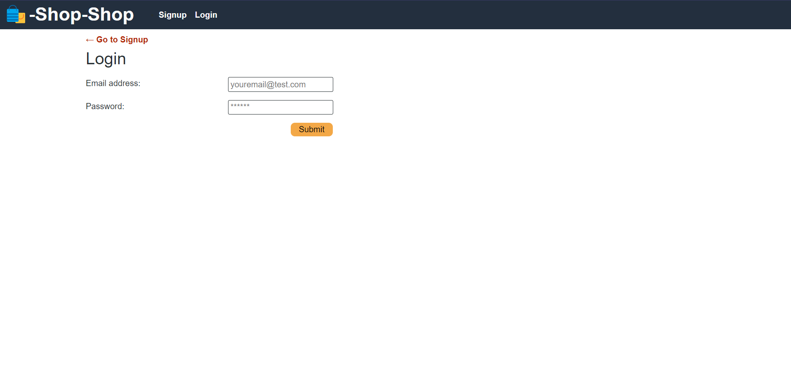
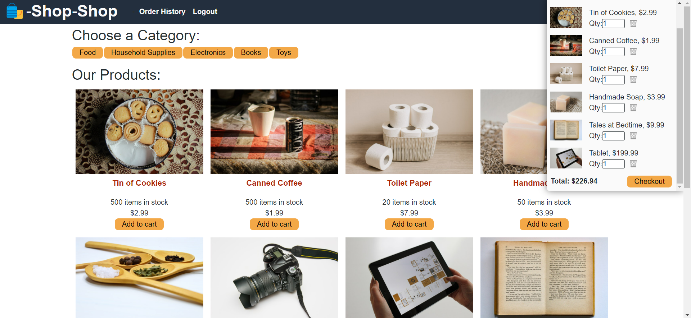
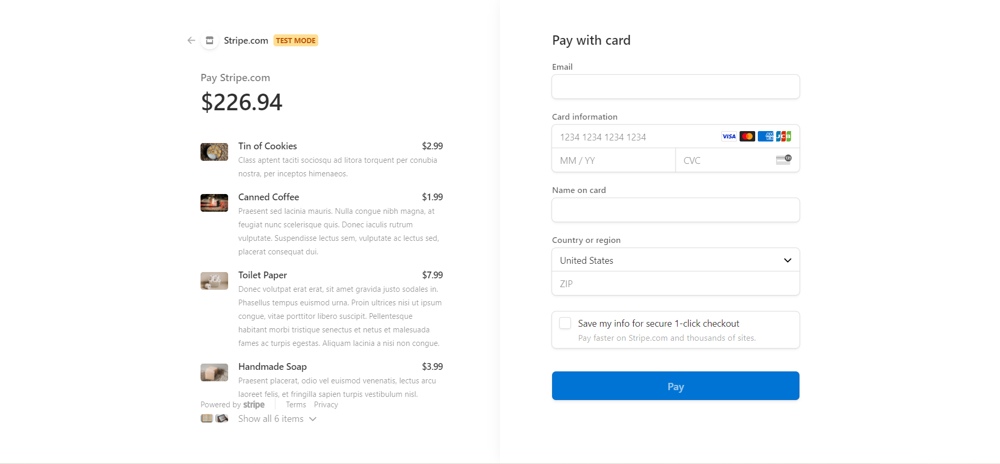

# Redux-Store

<a name="descsection"></a>
## Description
Refractoring code from one platform to another is an essential part of being a web developer.  In this project, I took a fully functioning website that was using React's Global State and refractored it to [Redux](https://redux.js.org/). Redux was not something I had previous experience with so I relied on Redux's documentation to guide me through this process. Now, go shopping and let Redux do the rest. 🛒🛍️

[](https://opensource.org/licenses/MIT)


## Table of Contents
1. [ Description. ](#descsection)
2. [ User Story. ](#usersection)
3. [ Acceptance Criteria. ](#acceptancesection)
4. [ Installation. ](#installsection)
5. [ License. ](#licensesection)
6. [ Contributing. ](#contribsection)
7. [ Tests. ](#testsection)
8. [ Questions. ](#questionssection)
9. [ Screenshots. ](#picsection)
10. [ Links. ](#linksection)
11. [ Resources/Credit. ](#creditsection)

<a name="usersection"></a>
## User Story
```
AS a senior engineer working on an e-commerce platform
I WANT my platform to use Redux to manage global state instead of the Context API
SO THAT my website's state management is taken out of the React ecosystem

```

<a name="acceptancesection"></a>
## Acceptance Criteria
```
GIVEN an e-commerce platform that uses Redux to manage global state
WHEN I review the app’s store
THEN I find that the app uses a Redux store instead of the Context API
WHEN I review the way the React front end accesses the store
THEN I find that the app uses a Redux provider
WHEN I review the way the app determines changes to its global state
THEN I find that the app passes reducers to a Redux store instead of using the Context API
WHEN I review the way the app extracts state data from the store
THEN I find that the app uses Redux instead of the Context API
WHEN I review the way the app dispatches actions
THEN I find that the app uses Redux instead of the Context API

```

<a name="installsection"></a>
## Installation
* Clone the repository using:
```
git clone https://github.com/laurelthorburn/Redux-Store.git
```
* Ensure you are in the current working directory
* Install dependencies by opening the terminal (ctrl + j on windows) and running:
```
npm install || npm i
```
* Run the project by typing the following in the terminal:
```
npm run start
```

<a name="licensesection"></a>
## License
Copyright <2021>

Permission is hereby granted, free of charge, to any person obtaining a copy of this software and associated documentation files (the "Software"), to deal in the Software without restriction, including without limitation the rights to use, copy, modify, merge, publish, distribute, sublicense, and/or sell copies of the Software, and to permit persons to whom the Software is furnished to do so, subject to the following conditions:

The above copyright notice and this permission notice shall be included in all copies or substantial portions of the Software.

THE SOFTWARE IS PROVIDED "AS IS", WITHOUT WARRANTY OF ANY KIND, EXPRESS OR IMPLIED, INCLUDING BUT NOT LIMITED TO THE WARRANTIES OF MERCHANTABILITY, FITNESS FOR A PARTICULAR PURPOSE AND NONINFRINGEMENT. IN NO EVENT SHALL THE AUTHORS OR COPYRIGHT HOLDERS BE LIABLE FOR ANY CLAIM, DAMAGES OR OTHER LIABILITY, WHETHER IN AN ACTION OF CONTRACT, TORT OR OTHERWISE, ARISING FROM, OUT OF OR IN CONNECTION WITH THE SOFTWARE OR THE USE OR OTHER DEALINGS IN THE SOFTWARE.

  <a name="contribsection"></a>
## Contributing
  
1. [Fork the repo!](https://docs.github.com/en/get-started/quickstart/fork-a-repo)
2. Create a feature branch:
```
git checkout -b yourname-branch
```
3. Commit changes:
```
git commit -m 'Your changes here'
```
4. Push to the branch:
```
git push origin yourname-branch
```
5. Submit a pull request and wait for it to be approved or denied.

  <a name="testsection"></a>
## Tests
No tests at this time

  <a name="questionssection"></a>
## Questions?
  Want to see more of my work? [Click here!](https://github.com/laurelthorburn)

  Questions/comments/concerns? Please send an email to codinglaurel@gmail.com
  

  <a name="picsection"></a>
  ## Screenshots
  
  
  
  


  <a name="linksection"></a>
  ## Links

  Deployed Heroku Site: https://laurels-redux-store.herokuapp.com/
  
  Github Site: https://github.com/laurelthorburn/Redux-Store

  <a name="creditsection"></a>
## Resources/Credit
* https://redux.js.org/
* https://redux.js.org/tutorials/fundamentals/part-1-overview
* https://devcenter.heroku.com/articles/nodejs-support#specifying-an-npm-version
* https://dev.to/lawrence_eagles/causes-of-heroku-h10-app-crashed-error-and-how-to-solve-them-3jnl